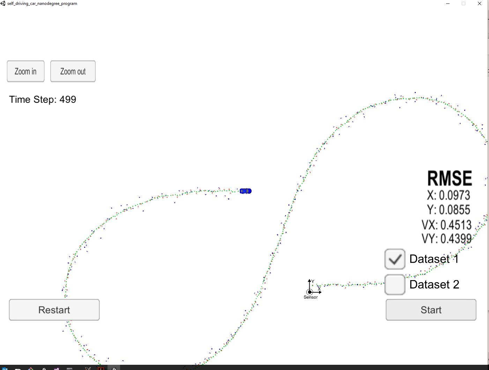

# Extended Kalman Filter Project

This project develops an extended kalman filter to track a simulated driving car, using radar and laser measurements. The radar measurements are provided in polar coordinates and includes speed data (from Doppler effect), while the lidar measurements only provide position data and no speed information.

The process flow used in this project is as follows:

## Building
To build:
* mkdir/cd build
* cmake ..
* make
* run ./ExtendedKF
* start the simulator found from [here](https://github.com/udacity/self-driving-car-sim/releases)

## Initialization/First measurement
The code for initlizing the kalman filter is found in the FusionEKF.cpp file, lines 68 - 103. Depending on the type of sensor we get our first measurement from, we initilize and save the timestamp to be able to record \delta t for later calculations.

The F, P are also initilized.

## Kalman filter flow
In the FusionEKF::ProcessMeasurement method, after the first measurment we first do the prediction step, and update the F and Q matrices with the appropriate \delta t. 

After prediction, if the data is coming from the lidar we use a simple update function to add the measurement data. However if the data comes from the radar, since it is nonlinear and uses polar coordinates, we need to use calculate Jacobian to be able to find the H matrix. Important to note that in calculating the Jacobian, we need to take measures to prevent division by zero.

## kalman_filter.cpp
The Update and UpdateEKF methods find the error between prediction and measurements, and then call the UpdateKF method which then finishes the Kalman filtering steps. It should be noted that when updating the radar measurements, we need to ensure that since the angle coming from the radar data falls between -pi and pi, our model also falls in that region. This is done by the NormalizeAngle method which chooses the appropriate region.

# Final code and results
The code for this project is found under src directory, and a video has been captured to see the performance of kalman filtering (EKF_test.mp4). The final result is shown here. It can be seen that the falls below the maximum range in the rubric of RMSE <= [.11, .11, 0.52, 0.52].

